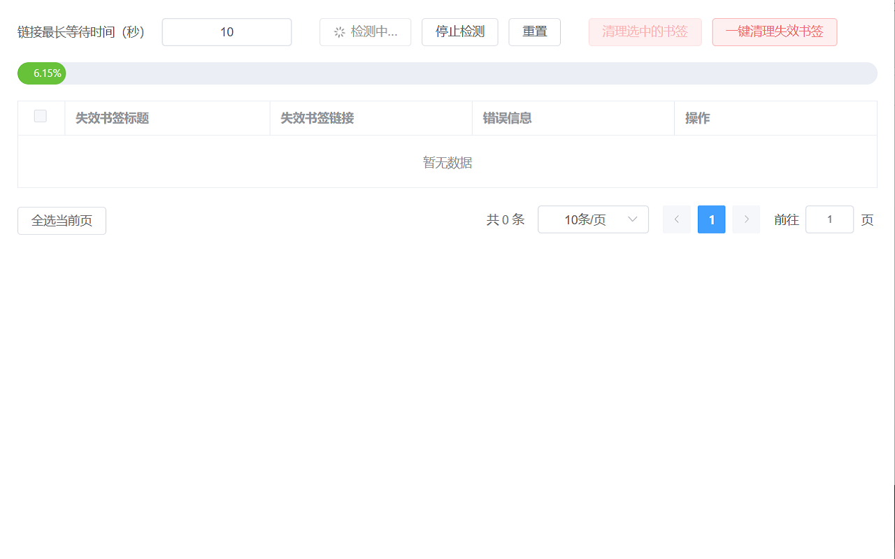
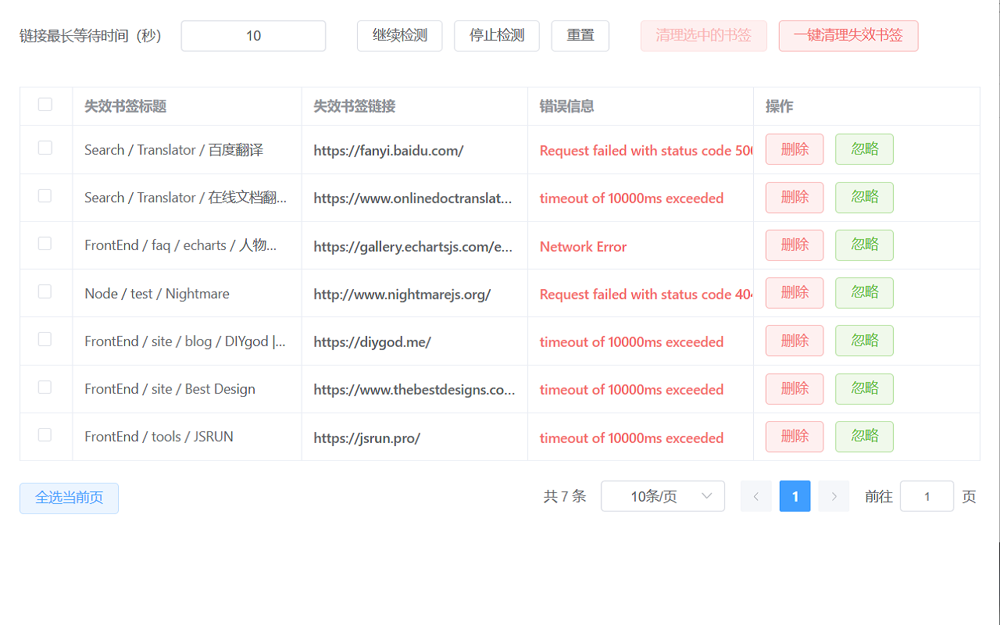
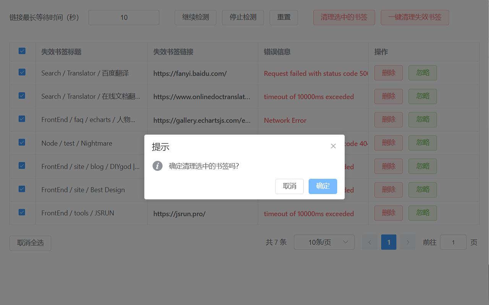

# Bookmark Cleaner

> 自动检测失效书签链接，一键清理 🚀







*没找到类似的插件，只好自力更生......*

## 如何启动

```sh
pnpm dev
```

打开浏览器扩展管理界面，开启`开发人员模式`，点击`加载解压缩的扩展`，选择 `dist` 目录即可。

## 发布打包

```sh
pnpm dist
```

打开自己的 Edge 开发者中心，上传 `dist/dist.zip` 即可。
